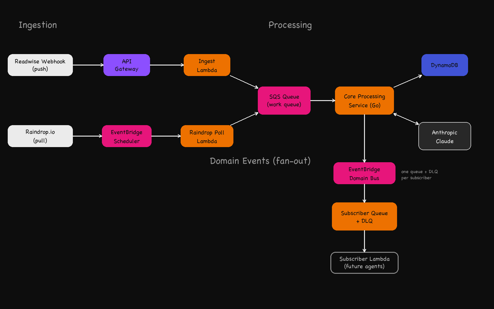

# Insight Processing Platform

An event-driven backend system that ingests webhook events, processes them asynchronously, enriches them with LLM-based
analysis, and stores structured insights using idempotent, reliable pipelines.

**Built with:** Go, AWS Lambda, SQS, DynamoDB, API Gateway, Cognito, Terraform, LLM (Anthropic Claude)

## What this project is - and is not

LLMs turn passive highlights into a structured knowledge graph and a weekly, self-critiqued action plan. That's the point of the system, not a bolt-on.

It is **not** a chatbot demo. There's no "ask your notes" search box shipped for its own sake. Every model call does a specific, scoped job (enrich an insight, extract a relationship, draft and critique a plan) inside the same event-driven pipeline as the rest of the system: idempotent, retried, budgeted, and safe to fail.

**LLMs**

- central to the product's value: enrichment today, knowledge graph construction and weekly planning next
- still a dependency like any other: timeout, retry-with-backoff, token cap, graceful degradation
- isolated so a failing call degrades one feature, never system reliability

**Sources (Readwise, Raindrop.io)**

- data sources
- event generators
- not the business model

The value lies in **how events are processed, enriched, connected, and acted on**, not in the integrations themselves.

The architecture is source-agnostic — not as an assertion, but as something the repo demonstrates: Readwise and Raindrop.io are two adapters (`internal/adapters/outbound/{readwise,raindrop}`) behind the same `ports.HighlightSource` port. Adding the second source touched only that adapter, its trigger transport (Readwise pushes a webhook; Raindrop has none, so it's polled on a schedule instead), and composition-root wiring. SQS, the worker, enrichment, tag membership, and EventBridge domain events did not change.

**Today vs. next:** shipped so far is ingestion → Go enrichment (Anthropic Claude, soft-fail). The roadmap (see `vision-backlog`-labeled epics) adds tag-based relationships across insights and a weekly Action Agent that generates, critiques, and revises its own plan, the system's one deliberate agentic loop, not a pattern used everywhere.

## High-level architecture overview



<details>
<summary>Same flow as text, with per-stage responsibilities</summary>

```
Readwise Webhook (push)          Raindrop.io (pull)
      │                                 │
      ▼                          EventBridge Scheduler
API Gateway                             │
      │                                 ▼
      ▼                          Raindrop Poll Lambda
Ingest Lambda                    - fetch highlights
  - validate                     - generate idempotency key
  - normalize                           │
  - generate idempotency key            │
      │                                 │
      └────────────────┬────────────────┘
                        ▼
                   SQS Queue
                     - buffering
                     - retry control
                     - backpressure
                        │
                        ▼
          Core Processing Service (Go)
            - domain logic
            - idempotent persistence
                        │
            ├───────────────────────────┐
            │                           ▼
            │                  Anthropic Claude
            │                    - enrich insight
            │                    - timeout + retry + token cap
            │                    - soft-fail: LLM down != system down
            ◄───────────────────────────┘
                        │
            ├───────────────────────────┐
            ▼                           ▼
        DynamoDB                EventBridge (domain bus)
                                         │
                                         ▼
                                Subscriber SQS Queue + DLQ
                                (one pair per subscriber, via
                                 terraform/modules/event-subscription)
                                         │
                                         ▼
                                 Subscriber Lambda
                                 (knowledge graph, Action Agent, ...)
```

</details>

Both ingest paths converge on the same queue and dedupe against each other via the shared idempotency key — a highlight imported through the REST import endpoints, Readwise's webhook, or a Raindrop poll all hash to the same key. See [ADR-010](docs/adr/010-multi-source-ingestion.md) for why polling replaces a webhook for Raindrop and why there's no poll cursor, and [ADR-008](docs/adr/008-idempotency-via-deterministic-key.md) for the key itself.

The SQS queue and the EventBridge bus are not interchangeable: the queue is point-to-point work distribution for the ingest pipeline (one consumer, retries, a DLQ); the bus is fan-out for domain facts (`InsightCreated`, `InsightEnriched`, ...), N subscribers, each isolated behind its own queue and DLQ. See [ADR-014](docs/adr/014-domain-events-on-eventbridge.md) for the full reasoning.

**Failure behavior**

- transient errors → retries
- permanent errors → DLQ
- LLM failure ≠ system failure

## Key design decisions (summary)

- **AWS managed primitives** for reliability and transparent cost modeling
- **API Gateway + Lambda + SQS** for decoupling, retries, and backpressure
- **Single core service** to avoid premature microservice complexity
- **DynamoDB (On-Demand)** for event-driven access patterns and zero idle cost
- **No Kubernetes**: control-plane cost and operational overhead are unjustified at this scale

All decisions are intentional and documented in ADRs.

## What this project demonstrates

- Event-driven system design with explicit decoupling at every layer
- Idempotent ingestion and safe at-least-once delivery handling
- Explicit failure taxonomy: DLQ for permanent errors, retries for transient, soft-fail for LLM
- Work queue vs. fact bus as a deliberate split, not an accident: SQS for point-to-point pipeline transport, EventBridge for fan-out domain events, each subscriber isolated behind its own queue and DLQ
- LLM integration as a first-class, disciplined dependency: timeout, retry-with-backoff, token cap, graceful degradation; scaling from single-insight enrichment to cross-insight relationships and self-critiqued planning
- Hexagonal architecture: domain logic fully decoupled from AWS infrastructure via ports and adapters
- Operational thinking (structured logging, cost-aware design)

This project is optimized for **system design signal**, not feature breadth.

## Explicit non-goals

- No Kubernetes
- No microservice sprawl
- No frontend focus
- No chatbot / RAG-over-notes demo; the LLM does specific jobs, not open-ended chat

Constraints are part of the design.

## Further documentation

- Architectural decisions: [`docs/adr/`](docs/adr/README.md)
- Setup & development: [`docs/setup.md`](docs/setup.md)
- Web UI (demo client): [`web/README.md`](web/README.md)
